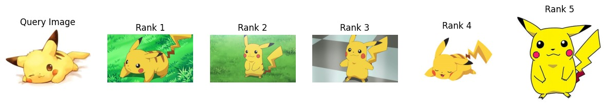
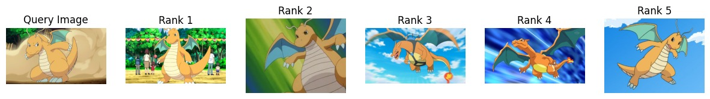

# Mini Vector Search Engine

So I will be trying to implement **Locality-Sensitive Hashing (LSH)** for fast image retrieval.

> **Note:** Prior to this project, I had no experience with LSH. This is a hands-on exploration and implementation from scratch.

---

## What is LSH

LSH stands for **Locality-Sensitive Hashing**.

Now let’s see what the key idea here is.

Let’s take the example of Spotify - there are millions (or probably more, idk) of songs on Spotify, right? Now, if Spotify wants to recommend songs to a user based on what they’re currently listening to, the brute force approach would be to compute the embedding of that song and then calculate the cosine similarity with the embeddings of all other songs in the database, finally returning the most similar ones.  

The issue is that there are *so many* songs in Spotify’s database.

The idea with LSH is that we say:  
> “I don’t want to compare with the entire dataset. I want to first get a smaller set of candidates which are most likely to contain the similar vectors. Once I get these candidates, I’ll just calculate the cosine similarity with them.”

Though the search quality might become a bit worse, the speed increases significantly. There are trade-offs, just like every other approach.

---

## Index and Indexing

The data structure which stores vectors and enables fast vector search is called an **index**.

**Indexing** refers to the process of creating this index.  
Indexing might take some time if there’s a lot of data, but the good thing is that it’s a one-time process.

---

## How Does LSH Work

### Indexing

The idea with LSH is that we use a **hash function** to assign buckets to each embedding - and similar vectors should ideally end up in the same or nearby buckets.

This hashing is done using **random hyperplanes**. We generate some random hyperplanes, and then we generate a hash string for each vector.  
Each bit in this hash string is determined by which side of a particular hyperplane the vector lies on.  
This hash string decides which bucket that vector belongs to.

We can calculate the distance between buckets using **Hamming distance**, which is just the number of mismatched bits in the hash strings.

All this is stored in the form of a hashmap - where the **keys** are the hash strings, and the **values** contain the IDs of whatever vectors belong to that bucket.

---

### Inference

Now, whenever we get a query (i.e., some new vector for which we want to return the top *k* results), we compute the hash string for that query vector and see which bucket it belongs to.  

Then, we consider all the members of this bucket as candidates and return the top *k* elements based on similarity.

To improve the quality of search, multiple hashmaps are usually maintained - each with their own set of random hyperplanes and hash strings.

The above process is repeated for each hashmap, and all candidates from all hashmaps are combined to get the final top *k* elements.

---

## Experiment

So I implemented LSH (or at least what I understood about it), and then collected a dataset of **10,523 Pokémon images** (mostly from the Kanto region) from Kaggle to see how my implementation performs.

Below are some results:

---

## Benchmarking

I also decided to benchmark how my implementation of LSH performs compared to:
- the **LSH implementation in FAISS**, and  
- **brute force vector search**.

Out of the 10,523 images in my dataset, I kept 1,000 as **queries** for the benchmark and used the rest as the dataset.  

First, I computed the **ground truth** for each query and stored them (for recall calculation later).  
The reason we do this is because we can’t measure the accuracy of our LSH implementation without knowing the ground truth values.  
The good thing is that we only need to do this calculation once.

Initially, my approach performed pretty badly (latency of ~512 ms) and had some technical flaws. After a bit of messing around and attempts at optimizing the code, , here are the **final results**:

---

### 🧮 Average Latency (per query)

| Method | Latency (ms/query) |
|:-------|-------------------:|
| Brute Force Vector Search | **17.0363** |
| My LSH Index | **3.8132** |
| FAISS LSH Index | **20.8056** |

---

### 📈 Average Recall (%)

| Method | Recall (%) |
|:--------|------------:|
| My LSH Index | **36.38%** |
| FAISS LSH Index | **2.16%** |

---

Now, I’m a bit skeptical about the fact that my LSH Index is both faster *and* more accurate than the FAISS implementation.  
Maybe it has something to do with the data, or maybe my LSH index is actually decent - idk.

Anyway, this was a really fun mini-project, and I learned a ton of stuff including:
- what indexing is  
- how LSH works  
- Hamming distance  
- code optimization   
- and more!

---

### References

Two blogs that were super helpful for me:
- [Similarity Search Part 6: Random Projections with LSH Forest](https://towardsdatascience.com/similarity-search-part-6-random-projections-with-lsh-forest-f2e9b31dcc47/)
- [Locality-Sensitive Hashing (Random Projection) - Pinecone](https://www.pinecone.io/learn/series/faiss/locality-sensitive-hashing-random-projection/)